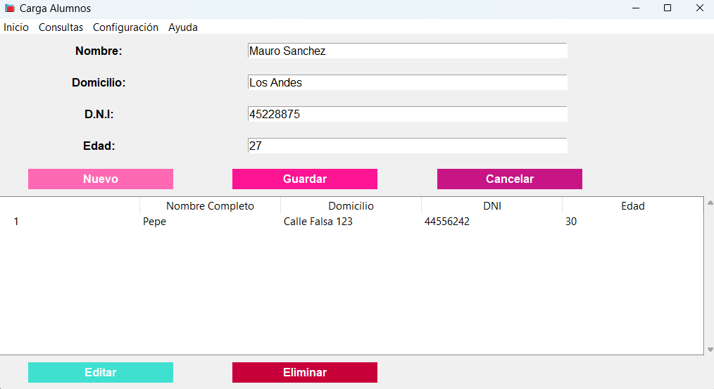

# Carga de alumnos
## Descripción

Este proyecto es un sistema básico de **CRUD** (Crear, Leer, Actualizar, Eliminar) para gestionar la carga de alumnos. Está desarrollado en Python utilizando la biblioteca tkinter para la interfaz gráfica y una base de datos SQLite para almacenar la información de los alumnos.

## Características principales



**Agregar alumnos:** 
-    Permite ingresar nuevos alumnos con información como nombre, apellido, edad, curso, etc.

**Listar alumnos:** 
-    Muestra todos los alumnos registrados en la base de datos.

**Actualizar alumnos:** 
-   Permite modificar la información de un alumno existente.

**Eliminar alumnos:** 
-   Elimina un alumno de la base de datos.

**Interfaz gráfica:** 
-   Utiliza tkinter para una interfaz amigable y fácil de usar.

## Tecnologías usadas

- **Python**
- **Tkinter**

## Uso

**Agregar un alumno:**

- Completa los campos del formulario (nombre, apellido, edad, curso, etc.).

- Haz clic en el botón "Guardar" para agregar el alumno a la base de datos.

**Listar alumnos:**

- Haz clic en el botón "Listar" para ver todos los alumnos registrados en una tabla.

**Actualizar un alumno:**

- Selecciona un alumno de la lista.

- Modifica los campos que desees y haz clic en "Actualizar".

**Eliminar un alumno:**

- Selecciona un alumno de la lista.

- Haz clic en el botón "Eliminar" para borrarlo de la base de datos.

## Como correr el programa

**Desde cmder:**
- cd --ruta del proyecto--
- python -m venv env
- ls
- env\Scripts\activate
- cd carga-alumnos\
- ls
- python carga-alumnos.py

## Instalación de paquetes
**Instalar Paquetes (dentro de env 'ls'):**
- pip show pip
- python -m pip install --upgrade pip
- pip install pylint
- pip install autopep8

## Para la distribución 
- pip install pyinstaller : "Lo corro con" = pyi-makespec carga-alumnos.py --windowed
- Se crea un archivo llamado carga-alumnos
- Buscas dentro del a = Analysis --> datas[] y dentro del corchete pones:
-     datas=[('./img/*.ico', 'img'), ('./database/*.db', 'database')],
- Ejecutas en el cdmer : pyinstaller carga-alumnos.spec

##  Estructura del proyecto
```
carga-alumnos/
├── build/                  # Carpeta generada automáticamente para builds temporales
├── localpycs/              # Archivos Python compilados (.pyc)
├── client/                 # Código del cliente o interfaz de usuario
│   ├── __init__.py         # Archivo de inicialización del módulo
│   └── gui_app.py          # Archivo principal de la interfaz gráfica
├── database/               # Base de datos del proyecto
│   └── alumnos.db          # Archivo de base de datos SQLite
├── dist/                   # Carpeta para distribuir el proyecto (ejecutables)
│   └── carga-alumnos       # Ejecutable generado
├── img/                    # Imágenes y recursos visuales
│   └── cp-logo.ico         # Icono de la aplicación
├── model/                  # Lógica de negocio y acceso a datos
│   ├── __init__.py         # Archivo de inicialización del módulo
│   ├── alumnos_dao.py      # Data Access Object (DAO) para manejar alumnos
│   └── _conexion_db.py     # Conexión a la base de datos
├── carga-alumnos.spec      # Archivo de configuración para PyInstaller
├── env/                    # Entorno virtual de Python
│   ├── Include/            # Incluye archivos de cabecera
│   ├── Lib/                # Bibliotecas de Python
│   ├── Scripts/            # Scripts del entorno virtual
│   └── pyvenv.cfg          # Configuración del entorno virtual
└── README.md               # Documentación del proyecto
